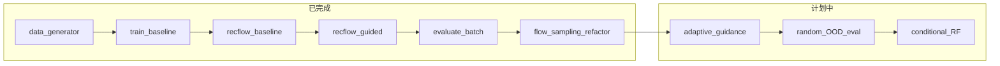

# 项目进展梳理（PROJECT_PROGRESS）

> 本文档用于**阶段汇报 / 答辩准备**，按时间线记录「要解决什么 → 做了什么 → 证明了什么 → 还有什么问题」。  
> 使用说明与命令见 [README.md](README.md)；答辩话术见 [DEFENSE_NOTES.md](DEFENSE_NOTES.md)。

---

## 一句话定位

在 3D 轨迹生成任务上复现 **Rectified Flow**，并在**不重新训练**的前提下，用推断期 **Energy Guidance** 提升**新障碍物（OOD）**场景下的避障成功率；当前已完成工程化采样、公平评测协议与 `distance_gated` 自适应引导。

---

## 技术路线总览



---

## 里程碑一览

| 阶段 | 状态 | 核心交付 | 关键文件 |
|------|------|----------|----------|
| **阶段一**：Baseline 框架 | 已完成 | 数据 → 训练 → 推断 → 可视化闭环 | `data_generator.py`, `model.py`, `train.py`, `recflow.py` |
| **阶段二**：Energy Guidance | 已完成 | 推断期势能引导 + 批量对比评测 | `recflow_guided.py`, `evaluate.py` |
| **阶段三**：采样模块化与公平评测 | 已完成 | `flow_sampling.py`、配对 `z0`、`evaluate` 更新 | `flow_sampling.py`, `evaluate.py` |
| Phase 1 Step 3 | 已完成 | `distance_gated` 自适应引导 + 三方法统一评估 | `flow_sampling.py`, `evaluate.py`, `recflow_guided.py` |
| Phase 1 Step 4 | 已完成 | 多障碍势能叠加 + 双球夹缝 demo | `flow_sampling.py`, `evaluate.py`, `recflow_guided.py` |
| Phase 1 Step 5 | 已完成 | 随机 OOD 场景评估 + 均值汇总 | `evaluate.py` |
| Phase 1 后续 | 进行中 | 消融 | 见文末「待办」 |
| Phase 2 | 未开始 | 条件化 Rectified Flow | `train_conditional.py`（计划） |

---

## 阶段一：搭建整体框架，实现 Rectified Flow Baseline

### 要解决的问题

- 课程项目需要完整复现 **1-Rectified Flow**：从高斯噪声生成与专家数据同分布的 3D 避障轨迹。
- 场景需可解释：固定起终点、中心球形障碍，轨迹由 Bezier 专家策略生成。

### 实现内容

| 模块 | 作用 |
|------|------|
| `data_generator.py` | 三次 Bezier 专家轨迹；过滤与原点障碍 `(0,0,0)` 碰撞的样本；输出 `(N, T, 3)` |
| `model.py` | `RectifiedFlowMLP`：轨迹展平 + 正弦时间嵌入，预测速度场 `v_θ(x_t, t)` |
| `train.py` | 插值 `x_t = t·x1 + (1-t)·x0`，损失 `MSE(v_θ, x1-x0)`；保存 checkpoint |
| `recflow.py` | Euler 采样：`z ← z + v_θ·dt`；3D 对比可视化 |
| `visualize_trajectories.py` | 数据集浏览 |

训练目标（与 `agent.md` 一致）：

```text
x_t = t * x1 + (1 - t) * x0
L = MSE(v_theta(x_t, t), x1 - x0)
```

### 验收与结论

- 能从 checkpoint 生成与专家轨迹形态相近的平滑曲线。
- **局限（为阶段二埋伏笔）**：模型只学习训练分布（障碍在原点），推断时**不显式输入**障碍物位置；换障碍后可能穿障。

### 常用命令

```bash
python data_generator.py --no-visualize --num-trajectories 5000 --seq-len 50 --obstacle-radius 1.0 --output-path dataset/toy_trajectories.npy
python train.py --data-path dataset/toy_trajectories.npy --checkpoint-path checkpoints/rectified_flow_mlp.pt --epochs 200 --seed 42
python recflow.py --checkpoint-path checkpoints/rectified_flow_mlp.pt --data-path dataset/toy_trajectories.npy --seed 42 --steps 20 --no-show
```

---

## 阶段二：加入 Energy-Guided 推断（`recflow_guided`）

### 要解决的问题

- Baseline 在 **OOD 障碍**（如球心移到 `(0, 1.5, 0)`）时，生成轨迹仍可能穿过障碍。
- 希望**不重训模型**，仅在采样时注入物理可行的排斥约束。

### 实现内容

- 新增 `recflow_guided.py`：与 baseline **共用同一 checkpoint**。
- 软边界球形势能：在 `r + margin` 内施加排斥梯度 `∇E`。
- 更新公式：

```text
z ← z + (v_theta(z, t) - lambda_t * grad_E(z)) * dt
```

- 可调参数：`guidance_scale`、`guidance_margin`、`guidance_decay`（constant / linear）、`max_guidance_norm`。
- 新增 `evaluate.py`：固定 **ID**（障碍在原点）与 **OOD**（障碍上移）两场景，批量对比 baseline / guided。

### 实验证据（历史一次完整跑通，200 样本）

配置：`num_samples=200`, `steps=20`, `seed=42`, `scale=3`, `margin=2`, `decay=constant`。

| 场景 | 方法 | 成功率 | 碰撞率 | 平滑度↓ | 路径长度 |
|------|------|--------|--------|---------|----------|
| ID 原点 | baseline | 0.90 | 0.10 | 0.30 | 18.1 |
| ID 原点 | guided | 0.985 | 0.015 | **4.50** | **53.0** |
| OOD (0,1.5,0) | baseline | 0.855 | 0.145 | 0.30 | 18.1 |
| OOD (0,1.5,0) | guided | **1.00** | **0.00** | 0.57 | 22.4 |

（数字来源：README 记录 / 早期 `outputs/evaluation_results.json`。）

### 结论

- **OOD**：Energy Guidance 显著提升避障成功率，最小障碍距离增大，说明引导确实改变了轨迹。
- **ID**：过强 constant 引导会**过度修正**（路径变长、平滑度变差），适合作为 OOD 修补手段，不宜无条件替代 baseline。
- **答辩可强调**：同一模型、推断期加物理项、计算开销小、可解释。

### 产出物索引

- 指标：`outputs/evaluation_summary.md`、`outputs/evaluation_results.json`
- 示意图：`outputs/base_ood.png`、`outputs/guided_constant_ood.png`、`outputs/guided_distance_gated_ood.png`

---

## 阶段三：采样模块化 + 配对初始噪声（Phase 1 Step 1–2）

### 要解决的问题

1. **代码重复**：`recflow.py` 与 `recflow_guided.py` 各维护一套 Euler / 梯度 / 障碍统计。
2. **对比不够严谨**：`evaluate.py` 若依赖「两次 `set_seed`」隐式对齐噪声，难以在汇报中说明「差异只来自 guidance」。
3. **后续扩展困难**：自适应引导、随机 OOD 评测需要在多处改积分循环。

### 实现内容

| 变更 | 说明 |
|------|------|
| 新增 `flow_sampling.py` | 集中 `euler_sample`、`guided_euler_sample`、`compute_obstacle_energy_gradient`、`obstacle_distance_stats`、`load_model_from_checkpoint` 等 |
| 支持 `z_init` | `make_initial_noise(..., z_init=None)`；传入时 baseline / guided 从同一 `z0` 出发 |
| 瘦身 CLI 脚本 | `recflow.py`、`recflow_guided.py` 仅保留参数解析与可视化 |
| 更新 `evaluate.py` | 每场景生成一次 `z0`，baseline 用 `z_init`，guided 用 `z_init.clone()` |
| 文档同步 | `README.md`、`DEFENSE_NOTES.md`、`agent.md` |

### 回归验证

- `guidance_scale=0` 时，guided 与 baseline 输出一致（max diff = 0）。
- `python evaluate.py --device cpu --num-samples 50` 跑通并更新 `outputs/`。

### 实验证据（配对 z0 后，50 样本）

| 场景 | 方法 | 成功率 | 平滑度↓ | 路径长度 |
|------|------|--------|---------|----------|
| ID | baseline | 0.90 | 0.306 | 18.07 |
| ID | guided | 1.00 | 4.62 | 54.06 |
| OOD | baseline | 0.84 | 0.306 | 18.07 |
| OOD | guided | 1.00 | 0.64 | 22.94 |

**可观察现象**：两场景下 baseline 的 smoothness / path_length **完全相同**——因为 baseline 生成不依赖障碍，且两场景共用同一 `z0`；这恰好说明配对协议生效。

说明行已写入 `outputs/evaluation_summary.md`：*baseline and guided use ... initial noise z0*。

### 结论

- 工程上形成**单一采样真源**，后续 Step 3（自适应引导）可以集中修改 `flow_sampling.py`。
- 评测协议可辩护：**控制变量为 guidance 项**。
- ID 下 guided 副作用仍然存在 → 阶段四已用 **distance_gated** 进行缓解。

### 常用命令

```powershell
$env:KMP_DUPLICATE_LIB_OK='TRUE'
python evaluate.py --device cpu --num-samples 200
```

---

## 阶段四：自适应 Guidance（Phase 1 Step 3）

### 要解决的问题

- `constant` guidance 在 OOD 场景中能显著提升避障成功率，但在 ID 场景下容易过度修正，表现为路径变长、平滑度下降。
- 希望在不重新训练模型的前提下，让 guidance 更集中地作用于靠近障碍物的轨迹点，减少远离障碍区域的副作用。

### 实现内容

| 变更 | 说明 |
|------|------|
| 新增 `distance_gated` | 在 `flow_sampling.py` 中对障碍距离计算 0–1 门控，越靠近障碍排斥越强，远离障碍逐渐减弱 |
| 收窄 guidance 选项 | 移除 `linear`，当前只保留 `constant` 与 `distance_gated` 两种可解释配置 |
| 更新 CLI | `recflow_guided.py` 与 `evaluate.py` 均支持 `--guidance-decay {constant,distance_gated}` |
| 合并评估输出 | `evaluate.py` 一次运行同时输出 `baseline`、`guided_constant`、`guided_distance_gated` |
| 清理输出目录 | `outputs/` 保留统一评估结果与三张 OOD 轨迹图 |

### 回归验证

- `python -m py_compile data_generator.py model.py train.py flow_sampling.py recflow.py recflow_guided.py evaluate.py visualize_trajectories.py check_sampling_regression.py`
- `python check_sampling_regression.py --device cpu`
- `guidance_scale=0` 时，guided 与 baseline 仍完全一致（max diff = 0）。
- `python evaluate.py --device cpu` 使用现有 checkpoint 重新跑通 200 样本统一评估。

### 实验证据（200 样本）

| 场景 | 方法 | 成功率 | 碰撞率 | 最小距离 | 平滑度↓ | 路径长度↓ |
|------|------|------:|------:|------:|------:|------:|
| ID 原点 | baseline | 0.9000 | 0.1000 | 0.1206 | 0.3040 | 18.1034 |
| ID 原点 | guided_constant | 0.9850 | 0.0150 | 0.6177 | 4.4957 | 53.0077 |
| ID 原点 | guided_distance_gated | **0.9950** | **0.0050** | **0.7542** | 2.0130 | 36.9326 |
| OOD (0,1.5,0) | baseline | 0.8550 | 0.1450 | 0.1298 | 0.3040 | 18.1034 |
| OOD (0,1.5,0) | guided_constant | **1.0000** | **0.0000** | **1.4554** | 0.5742 | 22.3743 |
| OOD (0,1.5,0) | guided_distance_gated | 0.9950 | 0.0050 | 0.9945 | **0.4701** | **20.5781** |

### 结论

- `distance_gated` 在 OOD 场景下仍显著优于 baseline，同时比 `constant` guidance 更平滑、路径更短。
- 在 ID 场景中，`distance_gated` 保持高成功率，并明显缓解 `constant` guidance 的过度修正问题。
- 当前输出统一为：
  - `outputs/evaluation_results.json`
  - `outputs/evaluation_summary.md`
  - `outputs/base_ood.png`
  - `outputs/guided_constant_ood.png`
  - `outputs/guided_distance_gated_ood.png`

### 常用命令

```powershell
$env:KMP_DUPLICATE_LIB_OK='TRUE'
python evaluate.py --device cpu
python recflow.py --checkpoint-path checkpoints/rectified_flow_mlp.pt --data-path dataset/toy_trajectories.npy --seed 42 --steps 20 --num-samples 50 --obstacle-center 0 1.5 0 --obstacle-radius 1.0 --save-fig outputs/base_ood.png --no-show
python recflow_guided.py --checkpoint-path checkpoints/rectified_flow_mlp.pt --data-path dataset/toy_trajectories.npy --seed 42 --steps 20 --num-samples 50 --obstacle-center 0 1.5 0 --obstacle-radius 1.0 --guidance-scale 3.0 --guidance-margin 2.0 --guidance-decay constant --max-guidance-norm 10.0 --save-fig outputs/guided_constant_ood.png --no-show
python recflow_guided.py --checkpoint-path checkpoints/rectified_flow_mlp.pt --data-path dataset/toy_trajectories.npy --seed 42 --steps 20 --num-samples 50 --obstacle-center 0 1.5 0 --obstacle-radius 1.0 --guidance-scale 3.0 --guidance-margin 2.0 --guidance-decay distance_gated --max-guidance-norm 10.0 --save-fig outputs/guided_distance_gated_ood.png --no-show
```

---

## 阶段五：多障碍扩展（Phase 1 Step 4）

### 要解决的问题

- 单球障碍只能验证最简单的避障泛化，不能说明 guidance 是否可以扩展到多个障碍物。
- 后续随机 OOD 和更复杂场景需要统一的多障碍梯度叠加与碰撞统计接口。

### 实现内容

| 变更 | 说明 |
|------|------|
| 多障碍梯度 | `flow_sampling.py` 支持多个球形障碍物的能量梯度叠加 |
| 多障碍门控 | `distance_gated` 对多个障碍取最大距离门控，靠近任一障碍时增强排斥 |
| 多障碍统计 | `obstacle_distance_stats` 支持 `(M, 3)` 障碍中心与 `(M,)` 半径；任一障碍碰撞即失败 |
| Guided CLI | `recflow_guided.py` 新增可重复的 `--obstacle X Y Z R`，并兼容旧的 `--obstacle-center/--obstacle-radius` |
| 双障碍评估 | `evaluate.py` 默认加入 `ood_double_gap` 场景，同时评估 baseline、constant、distance_gated |

### 实验证据（200 样本）

| 场景 | 方法 | 成功率 | 碰撞率 | 最小距离 | 平滑度↓ | 路径长度↓ |
|------|------|------:|------:|------:|------:|------:|
| OOD 双障碍 | baseline | 0.6150 | 0.3850 | 0.0978 | 0.3040 | 18.1034 |
| OOD 双障碍 | guided_constant | **0.9700** | **0.0300** | **0.8078** | 4.7778 | 52.0974 |
| OOD 双障碍 | guided_distance_gated | 0.9300 | 0.0700 | 0.6662 | **1.8873** | **34.2087** |

### 结论

- 多障碍势能叠加在双球夹缝场景中显著提升成功率，说明推断期 guidance 可以从单障碍自然扩展到多障碍。
- `guided_constant` 成功率最高，但路径和平滑度代价更大；`guided_distance_gated` 成功率仍远高于 baseline，同时路径更短、更平滑。
- 新增示意图：`outputs/guided_distance_gated_double_ood.png`。
- 双障碍图组：
  - `outputs/base_double_ood.png`
  - `outputs/guided_constant_double_ood.png`
  - `outputs/guided_distance_gated_double_ood.png`

### 常用命令

```powershell
$env:KMP_DUPLICATE_LIB_OK='TRUE'
python evaluate.py --device cpu
python recflow.py --checkpoint-path checkpoints/rectified_flow_mlp.pt --data-path dataset/toy_trajectories.npy --seed 42 --steps 20 --num-samples 50 --obstacle 0 1.5 0 1.0 --obstacle 0 -1.5 0 1.0 --save-fig outputs/base_double_ood.png --no-show
python recflow_guided.py --checkpoint-path checkpoints/rectified_flow_mlp.pt --data-path dataset/toy_trajectories.npy --seed 42 --steps 20 --num-samples 50 --obstacle 0 1.5 0 1.0 --obstacle 0 -1.5 0 1.0 --guidance-scale 3.0 --guidance-margin 2.0 --guidance-decay constant --max-guidance-norm 10.0 --save-fig outputs/guided_constant_double_ood.png --no-show
python recflow_guided.py --checkpoint-path checkpoints/rectified_flow_mlp.pt --data-path dataset/toy_trajectories.npy --seed 42 --steps 20 --num-samples 50 --obstacle 0 1.5 0 1.0 --obstacle 0 -1.5 0 1.0 --guidance-scale 3.0 --guidance-margin 2.0 --guidance-decay distance_gated --max-guidance-norm 10.0 --save-fig outputs/guided_distance_gated_double_ood.png --no-show
```

---

## 阶段六：随机 OOD 评估（Phase 1 Step 5）

### 要解决的问题

- 固定 OOD 点和双障碍 demo 仍然是少量手工场景，不能充分说明方法对不同障碍位置的稳定性。
- 需要用随机障碍分布评估 baseline、`guided_constant` 与 `guided_distance_gated` 的平均表现。

### 实现内容

| 变更 | 说明 |
|------|------|
| 随机场景生成 | `evaluate.py` 新增 `--random-ood-count N`，追加 N 个随机单障碍 OOD 场景 |
| 可控采样范围 | 支持 `--random-ood-y-range`、`--random-ood-z-range`、`--random-ood-radius-range` |
| 排除近原点样本 | `--random-ood-min-center-norm` 避免随机障碍过于接近训练内原点障碍 |
| 汇总输出 | Markdown 与 JSON 中加入 `random_ood_summary`，统计随机场景均值 |

### 实验证据（20 个随机 OOD 场景，200 样本）

采样配置：`y ∈ [-2.5, 2.5]`，`z ∈ [-1.5, 1.5]`，`radius ∈ [0.8, 1.2]`，`min_center_norm = 1.0`。

| 方法 | 成功率 | 碰撞率 | 最小距离 | 平滑度↓ | 路径长度↓ |
|------|------:|------:|------:|------:|------:|
| baseline | 0.8732 | 0.1267 | 0.1680 | 0.3040 | 18.1034 |
| guided_constant | **0.9995** | **0.0005** | **1.6380** | 0.6269 | 22.4427 |
| guided_distance_gated | 0.9975 | 0.0025 | 1.1977 | **0.4895** | **20.6685** |

### 结论

- 随机 OOD 结果说明 Energy Guidance 的提升不是只对固定 `(0, 1.5, 0)` 场景有效。
- `guided_constant` 仍给出最高成功率和最小碰撞率；`guided_distance_gated` 成功率非常接近，同时保持更低平滑度代价和更短路径。
- 主结果已合并到 `outputs/evaluation_results.json` 与 `outputs/evaluation_summary.md`。

### 常用命令

```powershell
python evaluate.py --device cpu --random-ood-count 20
```

---

## 当前仓库结构（推断相关）

```text
flow_sampling.py    # 采样、多障碍能量梯度与 distance_gated 自适应引导
recflow.py          # Baseline CLI 与 OOD 图生成
recflow_guided.py   # Guided CLI，支持 constant / distance_gated 与多障碍输入
evaluate.py         # 批量评测（配对 z0，统一输出三方法、多障碍和随机 OOD 对比）
train.py            # 训练（未改）
```

---

## 汇报时可用的三条主线

1. **我们复现了什么**：Rectified Flow 在 3D 轨迹上的完整 pipeline（阶段一）。
2. **我们的创新点是什么**：推断期 Energy Guidance，OOD 避障显著提升（阶段二）。
3. **我们如何保证对比可信**：模块化采样 + 配对 `z0`（阶段三）；`distance_gated` 自适应引导进一步缓解 ID 副作用。

---

## 已知局限（主动说明）

| 局限 | 说明 |
|------|------|
| 障碍几何 | 仅静态单球 + 软边界 |
| Guidance | 不参与训练；constant 引导在 ID 下路径过长 |
| 模型容量 | 整段 MLP，非序列 Transformer |
| 评测规模 | 固定 2 场景为主；随机 OOD 分布评测尚未完成 |
| 复现资产 | `dataset/`、`checkpoints/` 在 `.gitignore`，克隆后需本地生成 |

---

## 待办（按优先级）

### Phase 1（推断期方法深化）

- [x] **Step 3**：`distance_gated` 自适应引导
- [x] **Step 4**：多障碍物势能叠加 + 双球夹缝 demo
- [x] **Step 6**：`evaluate.py --random-ood-count` 随机障碍分布评测
- [ ] **Step 7**：`ablate_guidance.py` + Pareto 图；README 主表与 200 样本结果对齐

### Phase 2（训练期创新）

- [ ] 条件数据集（轨迹 + 障碍参数）
- [ ] `RectifiedFlowConditionalMLP` + `train_conditional.py`
- [ ] 四路对比：uncond / uncond+guided / cond / cond+guided

---

## 文档与计划索引

| 文档 | 用途 |
|------|------|
| [README.md](README.md) | 安装、命令、方法简介 |
| [DEFENSE_NOTES.md](DEFENSE_NOTES.md) | 答辩讲述顺序 |
| [agent.md](agent.md) | 开发规范与数学定义 |
| 本文档 `PROJECT_PROGRESS.md` | **阶段工作与证据链** |
| `.cursor/plans/phase1-step-by-step_*.plan.md` | 开发待办（本地） |
| `.cursor/plans/substantive-innovation-roadmap_*.plan.md` | 中长期路线（本地） |

---

## 更新记录

| 日期 | 摘要 |
|------|------|
| 2026-05 | 阶段一：Baseline 框架与训练推断闭环 |
| 2026-05 | 阶段二：`recflow_guided` + `evaluate.py` + OOD 对比实验 |
| 2026-05 | 阶段三：`flow_sampling.py`、配对 `z0`、文档同步 |
| 2026-05 | 阶段四：`distance_gated` 自适应引导、三方法统一评估、OOD 轨迹图更新 |
| 2026-05 | 阶段五：多障碍势能叠加、`ood_double_gap` 评估、双障碍轨迹图 |
| 2026-05 | 阶段六：随机 OOD 场景评估与均值汇总 |

*后续完成多障碍、随机 OOD 或消融实验时，请继续追加「实现 / 证据 / 结论」，并更新本表。*
