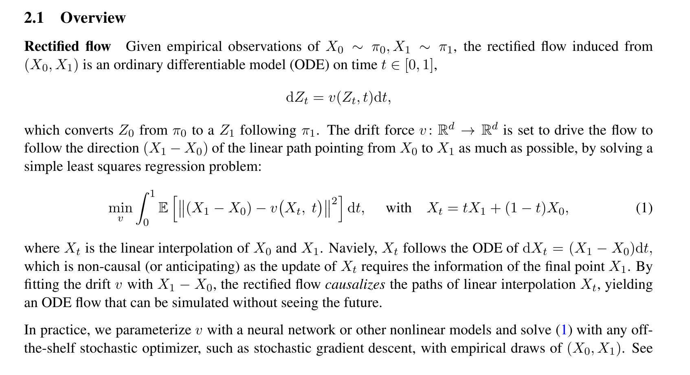
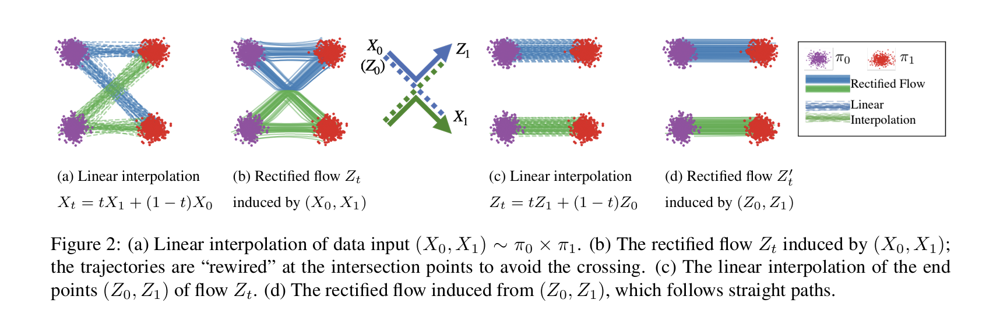
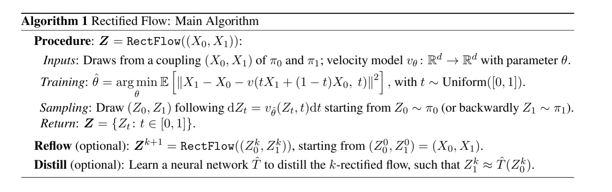

# 大作业项目：基于能量引导流匹配的动态避障轨迹生成
**(Energy-Guided Flow Matching for Dynamic Obstacle Avoidance)**

## 1. 选题背景与 AIGC 领域契合度
本项目聚焦于 AIGC 领域的**世界模型（World Models）与生成式具身智能**方向。
目前主流的生成模型多关注于离散像素（图像/视频），而探索连续物理空间中的运动学轨迹生成，是生成模型走向物理世界的前沿关键。传统的扩散模型（Diffusion）在轨迹生成中存在采样步数多、推理慢的问题，且面对训练分布外（OOD）的新障碍物时缺乏零样本适应能力。本项目旨在通过流匹配（Flow Matching）与能量引导（Energy Guidance）解决这一瓶颈。

## 2. 经典工作复现 (Baseline)
本项目的基础底座将严格复现以下经典生成模型理论：
*   **核心理论**：*Flow Matching for Generative Modeling* (Lipman et al., 2023) 与 *Rectified Flow* (Liu et al., 2022)。
*   **实现目标**：构建并训练一个基于 MLP 或 1D-DiT 架构的常微分方程（ODE）速度场预测网络 $v_\theta(x_t, t)$。实现从高斯噪声 $X_0 \sim \mathcal{N}(0, I)$ 到平滑无障碍物理轨迹 $X_1$ 的极速生成（$\le 10$ 步）。

## 3. 创新改进与核心技术路线
### 3.1 核心痛点
基础流匹配模型仅能生成拟合训练数据分布的轨迹。在推理阶段若环境中随机出现动态障碍物，原生模型生成的轨迹极易发生“穿模”或碰撞。

### 3.2 我们的创新：能量引导推理 (Energy-Guided Inference)
借鉴扩散模型中的分类器引导（Classifier-Guidance）思想，我们在**不重新训练基础流匹配网络**的前提下，在 ODE 推理阶段引入物理排斥势能场。

*   **势能函数定义**：定义障碍物排斥场 $E(x)$。
*   **引导型 ODE 求解**：将基础速度场修改为带有能量梯度的形式：
    $$ \frac{dx_t}{dt} = v_\theta(x_t, t) - \lambda_t \nabla_{x} E(x_t) $$
*   **动态衰减机制**：设计随时间或距离衰减的斥力系数 $\lambda_t$，确保势能场仅在轨迹接近障碍物时施加强干预，保证轨迹整体的平滑性与运动学合理性。

## 4. 实验设计与验证
我们将通过以下严谨的消融实验（Ablation Study）来验证改进的有效性：

### 4.1 定量评价指标 (Quantitative Metrics)
1.  **避障成功率 (Success Rate, SR)**：在 1000 个随机初始化的带障碍物环境中，计算未发生碰撞的生成轨迹占比。
2.  **轨迹平滑度 (Smoothness)**：通过计算轨迹的曲率能量（Curvature Penalty）或 Fréchet 距离，评估加入能量引导后是否引发轨迹剧烈抖动。
3.  **推理耗时 (Inference Speed)**：对比传统扩散模型（100步）与我们的引导式流匹配模型（10步）的端到端生成延迟。

### 4.2 定性分析评价 (Qualitative Analysis)
开发交互式 3D 仿真环境，通过直观的视觉对比，展示 Base 模型（发生碰撞）与 Ours 模型（完美绕行）在面对相同 OOD 障碍物时的行为差异。

## 5. 项目交付与交互演示 (Demo)
*   **前端交互**：基于 `Gradio` 构建 Web 界面。
*   **3D 可视化**：集成 `Plotly 3D` 组件。用户可在网页端通过滑块自由移动障碍物的 $(x, y, z)$ 坐标，后端实时响应并渲染出动态避障的三维空间轨迹。

## 6. 当前进展
1. 文献调研：[Flow Straight and Fast: Learning to Generate and Edit Data with Rectified Flow](http://arxiv.org/abs/2209.03003) 和 [Universal Guidance for Diffusion Models](https://arxiv.org/abs/2302.07121).  
第一篇文章核心：

  

第二篇文章核心：
待补全。
2. 复现第一篇文章工作
    1. dataset构建完成，参考[data_generator.py](./data_generator.py) 和 [visualize_trajectories.py](./visualize_trajectories.py)
    2. 复现[rectified flow](http://arxiv.org/abs/2209.03003)的主训练算法，参考[recflow.py](./recflow.py).  
        其中的调用文件链路是：[model.py](./model.py)为模型架构定义，[train.py](./train.py)为训练过程代码。  
        目前做好了初版demo，更精细的调参还没做。最终200轮训练之后，loss大概在0.36左右。

## 7. 推荐运行命令
建议在项目根目录下按以下顺序运行：

1. 安装依赖
```bash
pip install -r requirements.txt
```

2. 生成带碰撞过滤的训练数据
```bash
python data_generator.py --no-visualize --num-trajectories 5000 --obstacle-radius 1.0 --output-path dataset/toy_trajectories.npy
```

3. 训练 Rectified Flow baseline
```bash
python train.py --data-path dataset/toy_trajectories.npy --checkpoint-path checkpoints/rectified_flow_mlp.pt
```

4. 采样并可视化生成结果
```bash
python recflow.py --checkpoint-path checkpoints/rectified_flow_mlp.pt --data-path dataset/toy_trajectories.npy
```